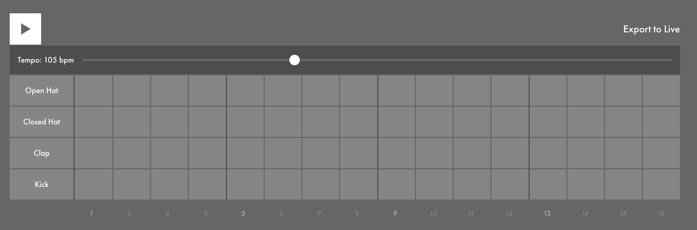

# Backbeats

In Strudel, do the following:

1. Create the "four on the floor" pattern in the Kick row again.
2. Add notes in the Clap row at the positions labeled 5 and 13.

Many styles of music that are "in four" feature a clap or snare on the second and fourth beat, a pattern known as a *backbeat*.

- Solution
    
    [https://strudel.cc/#c2V0Y3BtKDEwNS80KQoKJGNsYXA6IHMoIlt%2BIH4gfiB%2BXVtjcCB%2BIH4gfl1bfiB%2BIH4gfl1bY3AgfiB%2BIH5dIikuYmFuaygiUm9sYW5kVFI5MDkiKQoka2ljazogcygiW2JkIH4gfiB%2BXVtiZCB%2BIH4gfl1bYmQgfiB%2BIH5dW2JkIH4gfiB%2BXSIpLmJhbmsoIlJvbGFuZFRSOTA5Iik%3D](https://strudel.cc/#c2V0Y3BtKDEwNS80KQoKJGNsYXA6IHMoIlt%2BIH4gfiB%2BXVtjcCB%2BIH4gfl1bfiB%2BIH4gfl1bY3AgfiB%2BIH5dIikuYmFuaygiUm9sYW5kVFI5MDkiKQoka2ljazogcygiW2JkIH4gfiB%2BXVtiZCB%2BIH4gfl1bYmQgfiB%2BIH5dW2JkIH4gfiB%2BXSIpLmJhbmsoIlJvbGFuZFRSOTA5Iik%3D)
    

This combination of four-on-the-floor kicks with backbeat claps or snares is commonly used in many genres such as techno and house.

## Next: Bars

Next, we are going to learn about **Bars**

[Bars](Bars%202ac98431b24181d7882ff34bc652a7ce.md)

---

Previous: 

[Tempo and Genre](Tempo%20and%20Genre%202ac98431b24181e8a60ce9dc8d2250d3.md)